# 🔐 Sistema de Blockchain para PDFs - Diagramas de Flujo

## 📊 Diagrama General del Sistema

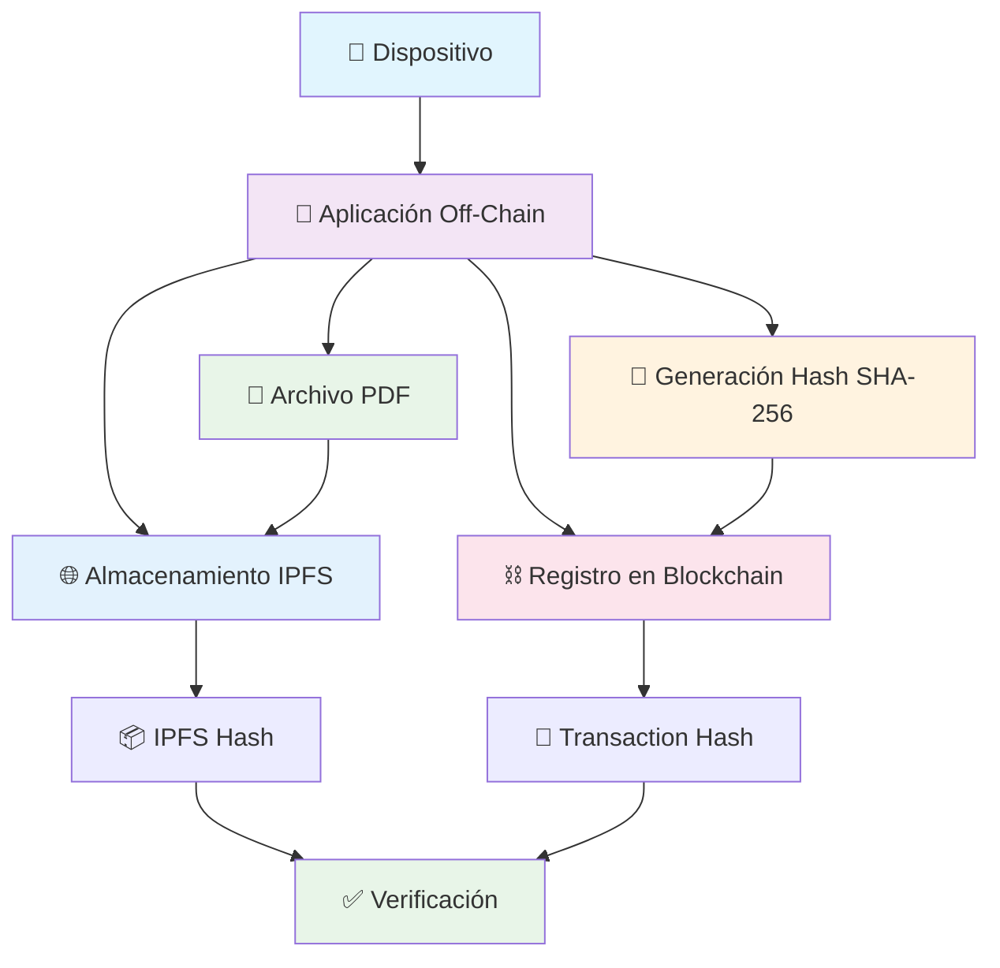

## 🔄 Flujo Detallado Paso a Paso

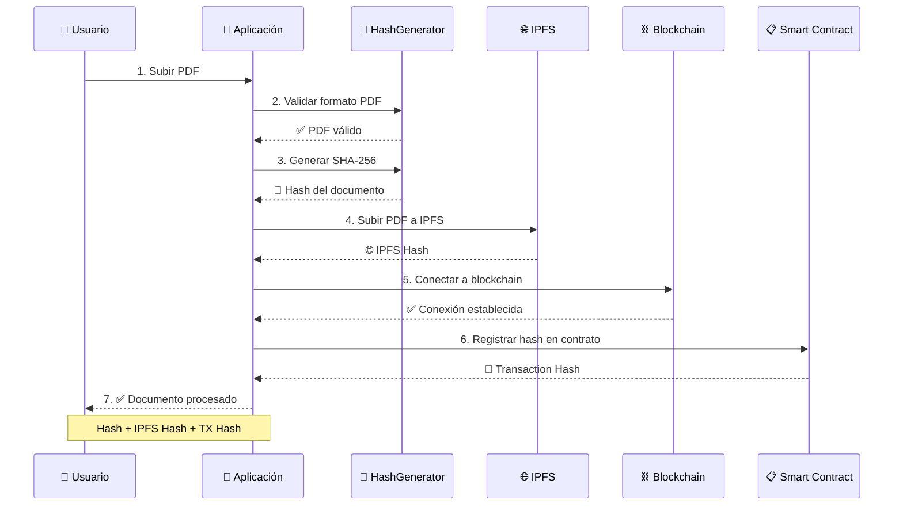

## 🏗️ Arquitectura de Componentes

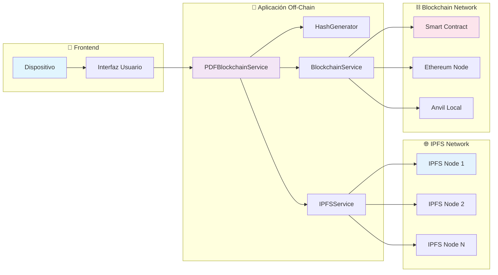

## 🔍 Proceso de Verificación

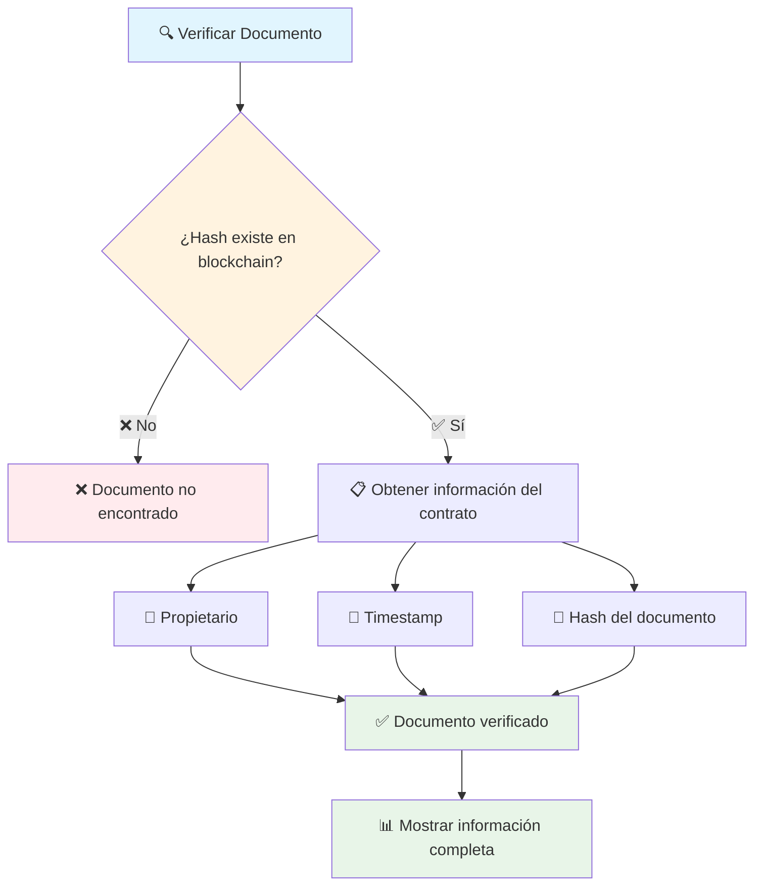

## 📦 Estructura de Datos

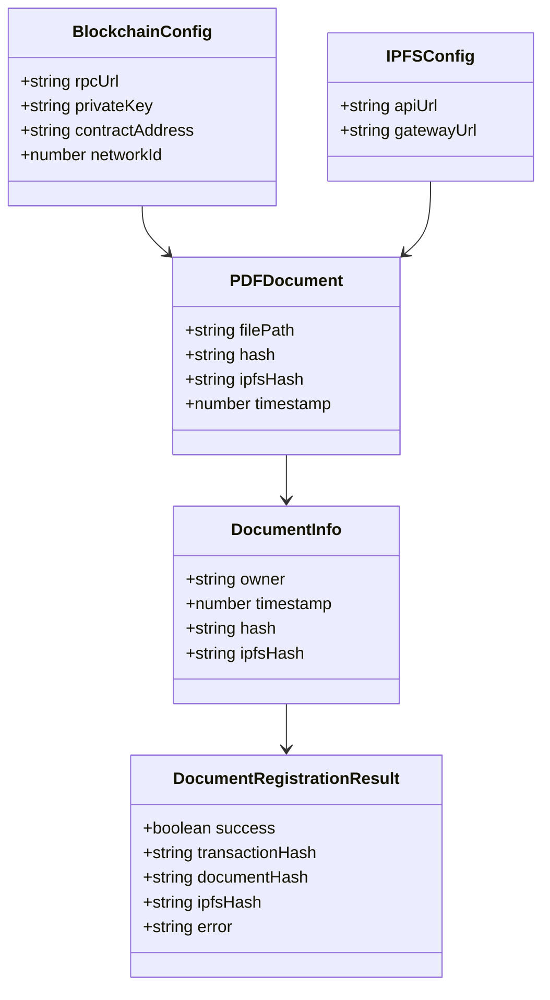

## 🚀 Flujo de Instalación y Configuración

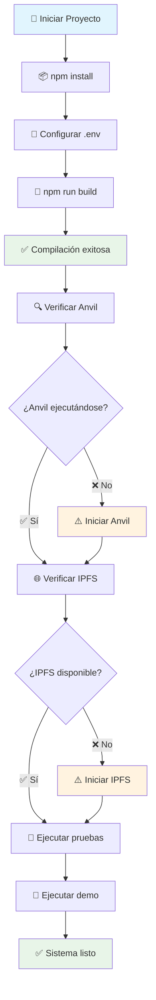

## 🔧 Comandos y Scripts

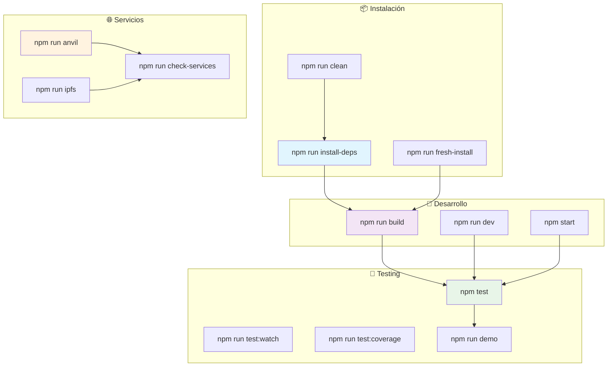

## 📊 Estados del Sistema

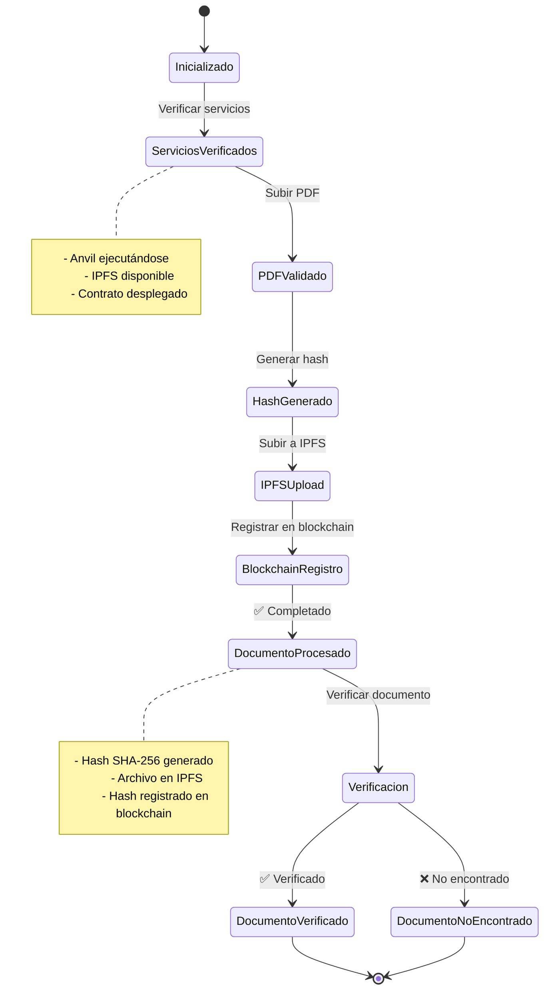

## 🔐 Seguridad y Validación

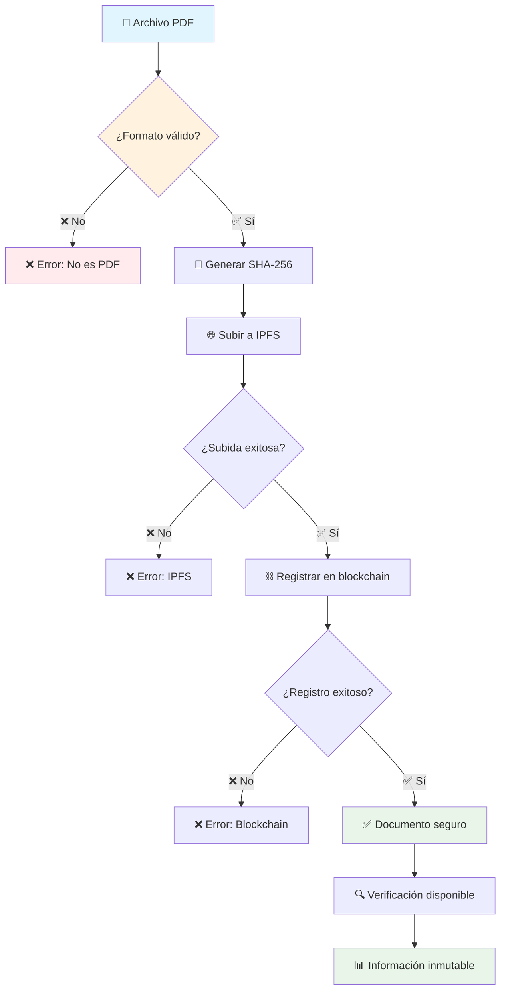

## 📈 Métricas y Monitoreo

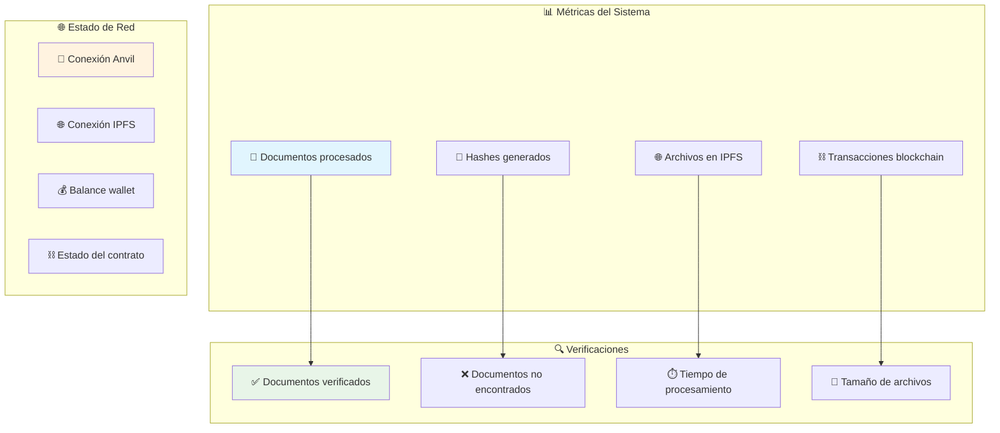

## 🎯 Casos de Uso

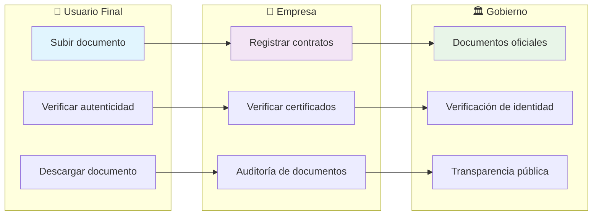

---

## 📋 Resumen de Diagramas

1. **Diagrama General**: Vista de alto nivel del sistema
2. **Flujo Detallado**: Secuencia paso a paso
3. **Arquitectura**: Componentes y sus relaciones
4. **Verificación**: Proceso de validación
5. **Estructura de Datos**: Modelos de información
6. **Instalación**: Configuración del sistema
7. **Comandos**: Scripts disponibles
8. **Estados**: Flujo de estados del sistema
9. **Seguridad**: Validaciones y verificaciones
10. **Métricas**: Monitoreo del sistema
11. **Casos de Uso**: Aplicaciones prácticas

Estos diagramas proporcionan una comprensión completa del sistema de blockchain para PDFs, desde la instalación hasta el uso en producción.
